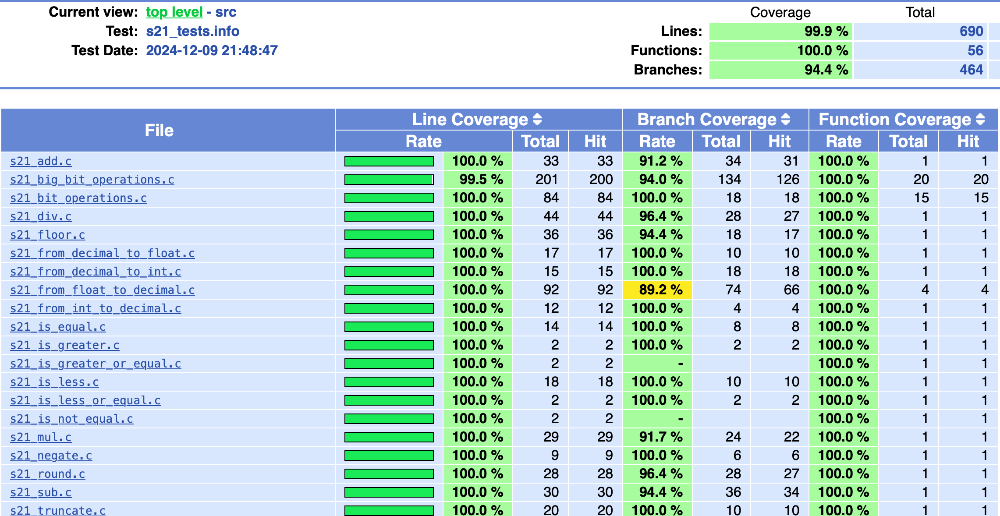

# C decimal

Implementation of own C *decimal.a* library.

 **Table of content:**

- [Project description](#item-one)
- [Binary representation](#item-two)
- [Implemented functions](#item-three)
- [Build](#item-four)
- [Unit tests](#item-five)
- [GCOV report](#item-six)
- [Authors](#authors)

 

### Description

This library is able to work with the "decimal" type, which is not in the language standard.  

The Decimal value type represents decimal numbers ranging from positive 79,228,162,514,264,337,593,543,950,335 to negative 79,228,162,514,264,337,593,543,950,335.  

A decimal number is a floating point value that consists of a sign, a numerical value where each digit in the value ranges from 0 to 9, and a scaling factor that indicates the position of a floating decimal point that separates the integral and fractional parts of the numerical value.  

The binary representation of a Decimal value consists of a 1-bit sign, a 96-bit integer number, and a scaling factor used to divide the 96-bit integer and specify what portion of it is a decimal fraction. The scaling factor is implicitly the number 10, raised to an exponent ranging from 0 to 28. Therefore, the binary representation of a Decimal value the form, ((-2^96 to 2^96) / 10^(0 to 28)), where -(2^96-1) is equal to MinValue, and 2^96-1 is equal to MaxValue.  

The scaling factor also can preserve any trailing zeros in a Decimal number. Trailing zeros do not affect the value of a Decimal number in arithmetic or comparison operations.

 

### Binary representation

The binary representation of a Decimal number consists of a 1-bit sign, a 96-bit integer number, and a scaling factor used to divide the integer number and specify what portion of it is a decimal fraction. The scaling factor is implicitly the number 10, raised to an exponent ranging from 0 to 28.  

Decimal number is implemented as a four-element array of 32-bit unsigned integers (`unsigned int bits[4];`).  

`bits[0]`, `bits[1]`, and `bits[2]` contain the low, middle, and high 32 bits of the 96-bit integer number accordingly.

`bits[3]` contains the scale factor and sign, and consists of following parts:

- Bits 0 to 15, the lower word, are unused.
- Bits 16 to 23 must contain an exponent between 0 and 28, which indicates the power of 10 to divide the integer number.
- Bits 24 to 30 are unused.
- Bit 31 contains the sign; 0 meaning positive, and 1 meaning negative.

 

### Implemented functions

#### Arithmetic Operations

| Operator name | Operators  | Function                                                                           |
| ------ | ------ |------------------------------------------------------------------------------------|
| Addition | + | int add(decimal value_1, decimal value_2, decimal *result)         |
| Subtraction | - | int sub(decimal value_1, decimal value_2, decimal *result) |
| Multiplication | * | int mul(decimal value_1, decimal value_2, decimal *result) |
| Division | / | int div(decimal value_1, decimal value_2, decimal *result) |

The functions return the error code:

- 0 - OK
- 1 - the number is too large or equal to infinity
- 2 - the number is too small or equal to negative infinity
- 3 - division by 0

- *When numbers do not fit into the mantissa during arithmetic operations, bank rounding is used (for example, 79,228,162,514,264,337,593,543,950,335 - 0.6 = 79,228,162,514,264,337,593,543,950,334)*

#### Comparison Operators

| Operator name | Operators  | Function |
| ------ | ------ | ------ |
| Less than | < | int is_less(decimal, decimal) |
| Less than or equal to | <= | int is_less_or_equal(decimal, decimal) |
| Greater than | > |  int is_greater(decimal, decimal) |
| Greater than or equal to | >= | int is_greater_or_equal(decimal, decimal) |
| Equal to | == |  int is_equal(decimal, decimal) |
| Not equal to | != |  int is_not_equal(decimal, decimal) |

Return value:

- 0 - FALSE
- 1 - TRUE

#### Convertors and parsers

| Convertor/parser | Function |
| ------ | ------ |
| From int  | int from_int_to_decimal(int src, decimal *dst) |
| From float  | int from_float_to_decimal(float src, decimal *dst) |
| To int  | int from_decimal_to_int(decimal src, int *dst) |
| To float  | int from_decimal_to_float(decimal src, float *dst) |

Return value - code error:

- 0 - OK
- 1 - convertation error

*Note on the conversion of a float type number:*

- *If the numbers are too small (0 < |x| < 1e-28), an error and value equal to 0 returned*
- *If the numbers are too large (|x| > 79,228,162,514,264,337,593,543,950,335) or are equal to infinity, an error returned*
- *When a number with the float type is processing, all the significant decimal digits contained in it are converted. If there are more than 7 such digits, the number is rounded to the closest one that does not have more than 7 significant decimal digits.*

*Note on the conversion from decimal type to int:*

- *If there is a fractional part in a decimal number, it should be discarded (for example, 0.9 is converted to 0)*

### Rounding functions + negate

| Description | Function                                                         |
| ------ |------------------------------------------------------------------|
| Rounds a specified Decimal number to the closest integer toward negative infinity. | int floor(decimal value, decimal *result)            | 
| Rounds a decimal value to the nearest integer. | int round(decimal value, decimal *result)    |
| Returns the integral digits of the specified Decimal; any fractional digits are discarded, including trailing zeroes. | int truncate(decimal value, decimal *result) |
| Returns the result of multiplying the specified Decimal value by negative one. | int negate(decimal value, decimal *result)   |

Return value - code error:

- 0 - OK
- 1 - calculation error

### Specifications

- The library is developed in C language of C11 standard using gcc compiler;
- Full coverage of library functions code with unit-tests using the Check library are prepared;
- Unit tests cover at least 80% of each function (checked using gcov);  
- A Makefile for building the library and tests (with targets all, clean, test, s21_decimal.a, gcov_report) is provided;
- The gcov_report target generates a gcov report in the form of an html page;
- The defined type supports numbers from -79,228,162,514,264,337,593,543,950,335 to +79,228,162,514,264,337,593,543,950,335.

 

### Build

1. go to `src` folder
2. run `make decimal.a` to build a library
3. now you can use `decimal.a` library and compile with any required program.

 

### Unit tests

1. go to `src` folder
2. run `make` to build all targets including (*decimal.a, test, gcov_report*) / or run `make test` to run tests separately
3. tests results will be printed to terminal

 

### LCOV report

1. go to `src` folder
2. run `make` to build all targets including (*decimal.a, test, gcov_report*) / or run `make gcov_report` to run tests with gcov separately
3. after report is generated go to `src/report` folder and open `index.html` file to see LCOV coverage

<figure>
  
<figcaption>LCOV report</figcaption>
</figure>

### Authors

S21 nicknames:

- donnapoc (Sviatoslav)
- directpi (Igor)
- rendailb (Matvey)
